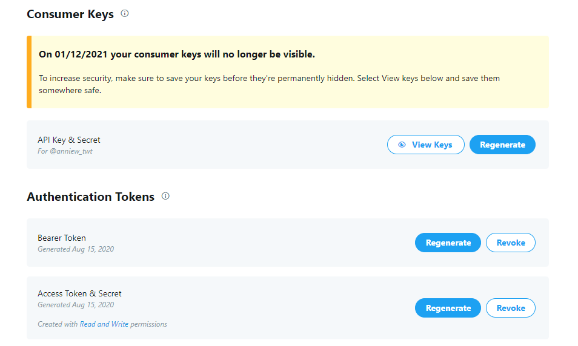
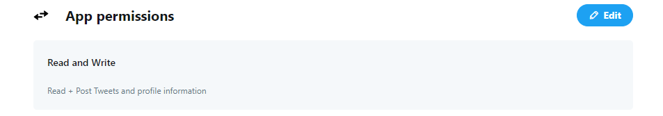
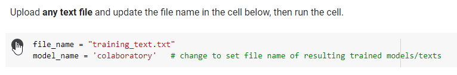
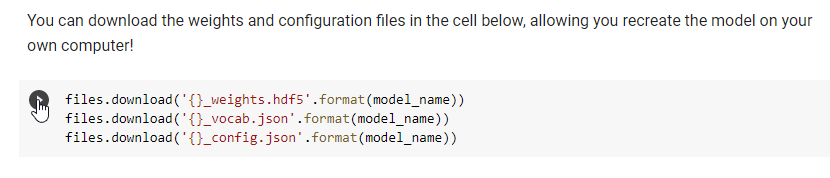
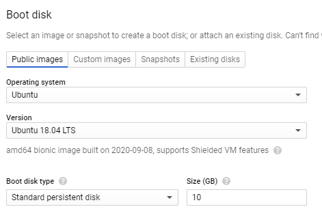

# RNN Twitter Bot :robot::pencil2:

[](https://www.python.org/downloads/release/python-379/)
[](https://github.com/Naereen/badges/)
<span class="badge-buymeacoffee"><a href="https://www.buymeacoffee.com/awu2303" title="Donate to this project using Buy Me A Coffee"></a>
</span>

A Twitter bot written in Python. The recurrent neural network Twitter bot is deployed on a Google Cloud Platform Virtual Machine Instance and tweets generated text with a temperature of 0.7 from the trained model.

---

### Table of Contents

- [Getting Started](#getting-started)
    - [Prerequisites](#prerequisites)
        - [To Train the Model](#to-train-the-model)
        - [To Run the Bot](#to-run-the-bot)
        - [To Host the Bot](#to-host-the-bot)
- [Instructions](#instructions)
    - [File Structure](#file-structure)
- [Deployment](#deployment)
- [Creator / Maintainer](#creator-maintainer)
- [Acknowledgments](#acknowledgments)
- [Additional Information](#additional-information)

---

## Getting Started

Make sure to follow [Twitter's Automation Rules](https://help.twitter.com/en/rules-and-policies/twitter-automation) to avoid getting your account banned.

### Prerequisites

#### To Train the Model

- [textgenrnn Colaboratory Notebook](https://colab.research.google.com/drive/1mMKGnVxirJnqDViH7BDJxFqWrsXlPSoK) - easily train your own text-generating neural network of any size and complexity for free on a GPU using Colaboratory

#### To Run the Bot

- [Python 3.6 or 3.7](https://www.python.org/downloads/release/python-379/)
- [Pip](https://pypi.org/project/pip/) - a python package manager
    - Download this [file](https://bootstrap.pypa.io/get-pip.py), open a command prompt and navigate to the folder containing the `get-pip.py` installer, and run `python get-pip.py` to install
        - Run `pip --version` to check if it has installed correctly
- [Tweepy](http://docs.tweepy.org/en/latest/index.html) - an easy-to-use python library for accessing Twitter's API
    - Run `pip install tweepy`
- [textgenrnn](https://github.com/minimaxir/textgenrnn) - a python3 module to easily train your own text-generating neural network of any size and complexity on any text dataset with a few lines of code, or quickly train on a text using a pretrained model
    - Run `pip install textgenrnn`

#### To Host the Bot

- [Google Cloud Platform](https://cloud.google.com/free) - a suite of cloud computing services that runs on the same infrastructure that Google uses internally for its end-user products, such as Google Search, Gmail, file storage, and YouTube

---

## Instructions

1. Apply for [Twitter Developer Access](https://developer.twitter.com/en/apply-for-access) with the account you want the bot to be used for.

2. Create a new [Twitter Application](https://developer.twitter.com/app/new) to generate your private keys, secrets, and tokens.



- Make sure the app settings has *Read and Write* permissions.



3. Create a file named `credentials.py` to hold your private information using the format below.
    - See [File Structure](#file-structure).

```
TWITTER_API_KEY="xxxx"
TWITTER_API_KEY_SECRET="xxxx"
TWITTER_ACCESS_TOKEN="xxxx"
TWITTER_ACCESS_TOKEN_SECRET="xxxx"
```

4. Adjustments you can make in `config.py` to tweak the bot to your liking. *(Make sure to follow [Twitter's Automation Rules](https://help.twitter.com/en/rules-and-policies/twitter-automation) to avoid getting your account banned.)*
    - **model_name** - (*MUST CHANGE*) Name of the model used for the weights and configuration files you downloaded from Colaboratory.
    
    - **temperature** - Level of randomness for the predicted text. Higher temperature will generate crazier text. 
    - **prefix** - Set a prefix if you want each generated text to start with a given seed text.
    - **n** - Number of texts to generate.
    - **max_gen_length** - Maximum number of characters for each text generated.
    - **max_tweet_length** - Maximum number of characters for each tweet to have.
        - If the generated text is too long, it will be split into multiple tweets at this length.
        - Set to 280 (Twitter's character limit for tweets) if you are not adding anything to the end of the tweets.
    - **add_to_tweet** - Optional if you want to add text to end of every tweet.
        - Set to None if you do not want to use.
    - **delay** - Time to wait in between each tweet in seconds.
    - **min_tweet_length** - Minimum number of characters in the tweet, will ignore tweets that are not long enough.
        - Set to 0 if this is not relevant to you.

5. Use the [textgenrnn Colaboratory Notebook](https://colab.research.google.com/drive/1mMKGnVxirJnqDViH7BDJxFqWrsXlPSoK) to train your RNN.
    - See [Additional Information](#additional-information) for more details. 

6. Download the weights and configuration files from the Colaboratory Notebook (as shown below) and put them in the `model` directory
    - See [File Structure](#file-structure).



7. Install all required packages needed to run the script

```
pip install -r requirements.txt
```

8. Run the script. Enjoy your Twitter bot!
```
python twitter-ai-bot.py
```

### File Structure

```
RNN-Twitter-Bot
|-- model
|   |-- yourmodelname_config.json
|   |-- yourmodelname_vocab.json
|   `-- yourmodelname_weights.hdf5
|-- credentials.py
`-- twitter-ai-bot.py
```
---

## Deployment

1. Launch a VM instance on Google Cloud Platform.
    - See [Additional Information](#additional-information) for more details.
    - Choose Ubuntu 18.04 LTS for the boot disk since it runs Python 3.6.9.

    

2. Upload the following files to the virtual machine.
    - See [Additional Information](#additional-information) for more details.


```
credentials.py
config.py
twitter-ai-bot.py
requirements.txt
yourmodelname_gentext.txt
yourmodelname_config.json
yourmodelname_vocab.json
yourmodelname_weights.hdf5
```

3. Create a directory named `model` and move the configuration and weight files into that directory

    - To create the directory
        ```
        mkdir model
        ```

    - To move the files
        ```
        mv yourmodelname_config.json model
        mv yourmodelname_vocab.json model
        mv yourmodelname_weights.hdf5 model
        ```

4. Install python and pip to the virtual machine.

```
sudo apt update 
sudo apt upgrade
sudo apt install python3
sudo apt install python3-pip
pip3 install update pip
```

- Check if python and pip have been installed correctly.
    - `python3 --version` should be 3.6.x or 3.7.x
    - `pip3 --version` should be 20.x.x

5. Install all required packages needed to run the script on the virtual machine.
```
sudo python3 -m pip install -r requirements.txt
```

8. Run the script. Enjoy!.
```
python3 twitter-ai-bot.py
```

- See [Additional Information](#additional-information) for details on running the script continuously.
    - I used the *screen* option.

---

### Creator / Maintainer

Annie Wu ([@anniewu2303](https://github.com/anniewu2303)) 

If you have any questions about the code, feel free to contact me anywhere below.

<p align="left">
  <a href="mailto:anniewu2303@gmail.com"> 
    
  </a>
  <a href="https://www.linkedin.com/in/anniewu2303/"> 
    
  </a>
  <a href="https://twitter.com/intent/follow?screen_name=anniew_twt"> 
    
  </a>
  <a href="https://www.instagram.com/anniewu_photo/"> 
    
  </a>
</p>

This project was created for educational purposes of learning development, documentation, and deployment and for personal and open-source use.

Default values of the project are used to run the Twitter account [@dickinson_rnn](https://twitter.com/dickinson_rnn), a bot that was trained to generate text with Emily Dickinson poems.

If you like my content or find this code useful, give it a :star: or support me by buying me a coffee :coffee::grinning:

<a href="https://www.buymeacoffee.com/awu2303" target="_blank"></a>

---

## Acknowledgments

- [Max Woolf](https://minimaxir.com/) 
    - creator of [textgenrnn](https://github.com/minimaxir/textgenrnn)
    - creator of the [textgenrnn Colaboratory Notebook](https://colab.research.google.com/drive/1mMKGnVxirJnqDViH7BDJxFqWrsXlPSoK) that allows us to quickly train the RNN with a GPU for free

---

## Additional Information

- textgenrnn
    - [Max Woolf's YouTube Video on Training a Text-Generating Neural Network for Free with textgenrnn](https://www.youtube.com/watch?v=RW7mP6BfZuY)
    - [Max Woolf's Blog Post on How to Quickly Train a Text-Generating Neural Network for Free](https://minimaxir.com/2018/05/text-neural-networks/)
    - [Max Woolf's Demo of using the Colaboratory Notebook](https://github.com/minimaxir/textgenrnn/blob/master/docs/textgenrnn-demo.ipynb)

- Google Cloud Playform VM Instance
    - [Tutorial on Hosting Python Scripts on Google Cloud](https://www.youtube.com/watch?v=5OL7fu2R4M8)
    - [Tutorial on Uploading Files to the VM Instance](https://intellipaat.com/community/9361/how-to-continuously-run-a-python-script-on-an-ec2-server)

